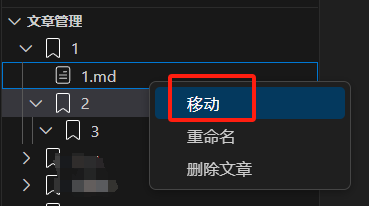
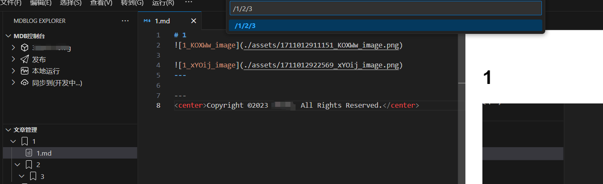

# MDBlog

<div align="center">
  
</div>

基于Markdown的轻量级静态博客系统，同时支持导出为可以部署的静态博客。

## 1. Features 

- 博客基础功能：分类管理、文章管理、自动生成索引
- 快捷指令：快捷输入表格、mermaid、wavedrom、代码块
- 发布：将Markdown发布为HTML文件
- (可选) 本地预览功能：基于live-server支持本地预览发布的HTML文件

## 2. Tip

- 如果需要使用**本地服务预览**，请先安装`Node.js`，然后安装使用命令`npm install -g live-server`来安装`live-server`，
- 建议配合插件 [**Markdown Preview Enhanced**] 使用，vscode编写md即可预览，编写完成后发布为静态博客
- **! 警告**：如果您使用Windows，请**不要在C盘**建立MDBlog的文件夹，由于权限问题，会导致某些功能无法使用。
- **不要**再`<do-not-delete-me>`标签内**编写内容**，或者**删除它**，会导致MDB的无法自动生成索引
    

## 3. Quick Start

### 3.1 MDBlog初始化

- 初始化

然后根据提示输入博客名和作者（使用英文逗号分割）

- 输入信息


### 3.2 新建、编辑、删除分类

- 新建一级分类


- 新建次级分类，次级分类可以继续新建下一级分类


- 删除、重命名分类


- 移动分类
    - 需要移动的分类，右击菜单选择移动
       

    - 根据提示输入需要移动到的位置，回车确认移动
    

### 3.3 新建、编辑、删除文章

- 新建文章


其他同分类操作

### 3.4 发布和预览

- 发布Markdown文件为HTML文件

    - **发布**：发布当前编辑器的md文件
    - **更新发布**：发布已经保存的md文件
    - **全部发布**：发布全部md文件

- **本地服务预览**HTML文件（请确保已经按照Node.js和live-server）

    - **启动**：启动live-server
    - **停止**：停止live-server
    - **查看**（默认浏览器）：使用默认浏览器打开发布的静态博客
- **直接预览**HTML文件（不需要安装live-server）
    - [发布] -> [右击] -> [打开发布(资源管理器)] -> 双击打开首页index.html

### 3.5 快捷命令
MDBlog支持快捷命令，输入`mc.`即弹出提示框。
> Tip: **为了便于MDBlog管理图片，请务必使用快捷命令插入图片和删除图片**

- 插入图片
    1. 复制你要粘贴的图片
    2. 新行输入命令`mc.insert_img`回车
    3. 粘贴图片，MDBlog自动管理图片和生成新索引
- 删除图片
    1. 光标放在图片格式前后位置，**不可在中间**
    2. 输入命令`mc.delete_img`回车
    3. MDBlog自动删除图片和相关索引
- 新建表格
    1. 新行按如下格式`行数, 列数, 对齐方式`输入需要的表格
    2. 行数和列数都是数字，对齐方式可选`l`左对齐，`c`居中对齐，`r`右对齐
    3. 例如输入`2,3,c`，紧接着输入mc.insert_table回车
    4. 自动生成2行3列，居中对齐的表格
- 插入代码块
    1. 新行输入需要的语言,例如`c`或者`java`
    2. 紧接着输入`mc.insert_code_block`回车
    3. 自动生成对应的代码块
- 插入mermaid
    1. 新行输入`mc.insert_mermaid_xxx`命令，即可生成对应的mermaid示例
        ```mermaid
        sequenceDiagram
            participant A
            participant B
            A ->> B: req_1
            B -->> A: resp_ack
        ```
- 插入wavedrom
    1. 新行输入`mc.insert_wavedrom_xxx`命令，即可生成对应的wavedrom示例
        ```wavedrom
        {
            signal: 
            [
                {name: 'clk',   wave: 'p..Pp..P'},,
                ['Master',,
                    ['ctrl',
                        {name: 'write', wave: '01.0....'},
                        {name: 'read',  wave: '0...1..0'}
                    ],
                        {name: 'addr',  wave: 'x3.x4..x', data: 'A1 A2'},
                        {name: 'wdata', wave: 'x3.x....', data: 'D1'   },
                ]
            ]
        }
        ```
- 插入当前时间
    1. 新行输入`mc.insert_date`，即可自动获得当前时间，格式为`yyyy-MM-dd HH:mm:ss`

## 4. Keybindings

| 功能                 | 快捷键     |
| -------------------- | ---------- |
| 初始化New MDBlog     | `ctrl+m i` |
| 打开New MDBlog       | `ctrl+m o` |
| 全部发布             | `ctrl+p a` |
| 更新发布             | `ctrl+p s` |
| 发布（当前编辑）     | `ctrl+p c` |
| 查看网页(默认浏览器) | `ctrl+p o` |
| 本地预览-启动        | `ctrl+m s` |
| 本地预览-停止        | `ctrl+m t` |

## 5. Release Notes

更多信息请查看[CHANGELOG](./CHANGELOG.md)

### 1.0.1 (24.03.02)

基础版本：基础博客功能

---

## 6. For more information

* 本插件基于[crossnote](https://github.com/shd101wyy/crossnote)开发

## 7. License
[License](./License.md)

**Enjoy!**
